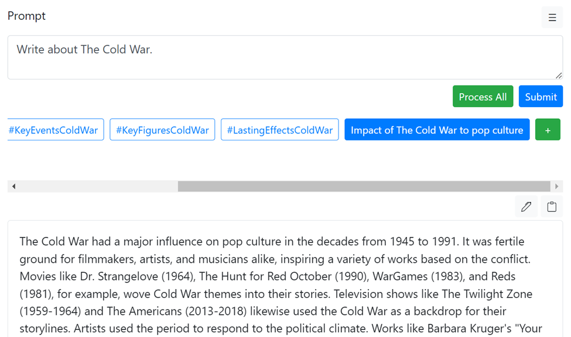
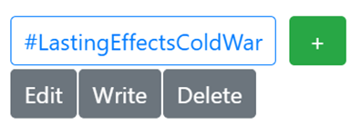

# A writing assistant tool using OpenAI API
## Ability: 
- Receive a prompt and suggest ideas (mini-prompt)
- User can add, modify, re-order mini-prompts
- Provide interactive way to re-order writing results by manipulate mini-prompts, apply different parameters for each mini-prompts
- Process mini-prompts one-by-one or process all
- Avoid reach openAI tokens limit by dividing writing task into smaller tasks

### How to install:
```
git clone https://github.com/gavotte25/cot_web.git
cd cot_web
```
Create an '.env' file in cot_web folder to save your Open API Key. Check it here https://platform.openai.com/account/api-keys
```
API_KEY=[YOUR OPENAI API KEY]
```
Finally,
```
docker compose up
```
### How to use web:
- Step 1: Write a prompt and click
- Step 2: Click "Submit"
- Step 3: Review generated mini-prompt (optional)
- Step 4: Click "Process All" or click on mini-prompt, click "Write" on the popup menu



